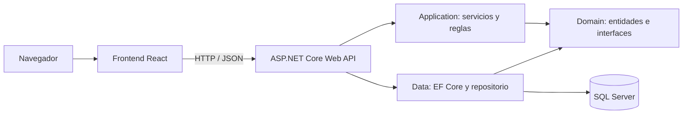

# Mini CRM Zoco — Seguimiento comercial

Aplicación para administrar clientes, registrar gestiones comerciales y consultar próximos seguimientos. El frontend React y el backend ASP.NET Core se organizan como carpetas independientes dentro de este mismo repositorio.

## 🎬 Video
[](https://drive.google.com/file/d/1ungjSUbcLrUPMWBaKlLVbOdGSlb9KYri/view?usp=sharing)

## Índice

1. [Requisitos necesarios para ejecutar el proyecto](#requisitos-necesarios-para-ejecutar-el-proyecto)
2. [Pasos para instalarlo](#pasos-para-instalarlo)
3. [Pasos para ejecutar frontend y backend](#pasos-para-ejecutar-frontend-y-backend)
4. [Configuración de la base de datos](#configuración-de-la-base-de-datos)
5. [Decisiones técnicas relevantes](#decisiones-técnicas-relevantes)
6. [Funcionalidades completadas](#funcionalidades-completadas)
7. [Funcionalidades pendientes](#funcionalidades-pendientes)
8. [Problemas conocidos, en caso de existir](#problemas-conocidos-en-caso-de-existir)

## Requisitos necesarios para ejecutar el proyecto

- Git, para obtener el repositorio.
- .NET 8 SDK y la herramienta `dotnet-ef` 8.0.11.
- Node.js 22 LTS y npm.
- Una instancia de SQL Server en ejecución y accesible desde el backend.
- Un navegador web moderno.

Tecnologías utilizadas: ASP.NET Core Web API, Entity Framework Core, SQL Server, xUnit, React, Vite, React Router, Axios y React Hook Form.

## Pasos para instalarlo

El repositorio contiene estas dos carpetas:

- Backend: `zocoCrm2026Back/`
- Frontend: `zocoCrm2026Front/`

Desde la raíz del proyecto, restaurá las dependencias del backend:

```bash
cd zocoCrm2026Back
dotnet restore ZocoCrm2026Back.sln
dotnet tool install --global dotnet-ef --version 8.0.11
```

Si ya tenés `dotnet-ef` instalado, actualizalo a esa versión con `dotnet tool update --global dotnet-ef --version 8.0.11`.

En otra terminal, instalá las dependencias del frontend:

```bash
cd zocoCrm2026Front
npm ci
```

Configurá la conexión a SQL Server siguiendo la sección [Configuración de la base de datos](#configuración-de-la-base-de-datos).

## Pasos para ejecutar frontend y backend

### Backend

Desde la raíz del proyecto backend:

```bash
dotnet run --project zocoCrm2026Back.Api --launch-profile http
```

La API queda disponible en `http://localhost:5266` y Swagger en `http://localhost:5266/swagger`.

### Frontend

Desde la raíz del proyecto frontend:

```bash
npm run dev
```

Vite informa en la terminal la dirección local para abrir en el navegador. Axios usa `/api` como URL base predeterminada y Vite reenvía esas solicitudes a `http://localhost:5266`, por lo que no hace falta definir `VITE_API_URL` para el desarrollo local. La API debe estar iniciada para que funcionen las operaciones que consultan o modifican datos.

## Configuración de la base de datos

El backend usa SQL Server mediante Entity Framework Core. Si no tenés una instancia en ejecución, levantala con Docker (recomendado):

```bash
docker run -e "ACCEPT_EULA=Y" -e "MSSQL_SA_PASSWORD=<tu-password>" -p 1433:1433 --name zoco-sql -d mcr.microsoft.com/mssql/server:2022-latest
```

Reemplazá `<tu-password>` por una contraseña fuerte (mínimo 8 caracteres, con mayúsculas, minúsculas, números y símbolos, como exige SQL Server) y usá esa misma en la cadena de conexión de abajo. Verificá que quedó corriendo con `docker ps` (tiene que figurar `zoco-sql` en `1433`). Si el contenedor ya existe de antes, en vez de crearlo iniciálo con `docker start zoco-sql`.

Este comando levanta solo el motor vacío; la base, las tablas y los datos los crean tus migraciones y el seed de los pasos siguientes.

El proyecto ya tiene habilitado User Secrets. Desde la raíz del proyecto backend, guardá una cadena de conexión para una instancia local que escuche en el puerto `1433` y use autenticación SQL:

```bash

```bash
dotnet user-secrets set "ConnectionStrings:DefaultConnection" "Server=localhost,1433;Database=ZocoCrm;User Id=sa;Password=<tu-password>;TrustServerCertificate=True;" --project zocoCrm2026Back.Api
```

Reemplazá `<tu-password>` por la contraseña configurada para ese usuario en tu instancia. User Secrets mantiene la credencial fuera del repositorio. El ejemplo usa el catálogo `ZocoCrm`, separado de otras bases. Aplicá las migraciones desde esa misma carpeta:

```bash
dotnet ef database update --project zocoCrm2026Back.Api --startup-project zocoCrm2026Back.Api --context ZocoCrmContext -- --environment Development
```

El comando crea o actualiza el esquema del catálogo indicado en la cadena de conexión. No lo apuntes a una base existente que contenga tablas o datos que deban conservarse. Al iniciar la API se cargan asesores, clientes y gestiones desde los JSON de `zocoCrm2026Back.Data/Sources`: se agregan los registros cuyos IDs todavía no existen; los registros existentes no se actualizan ni se sobrescriben. Para revisar la carga inicial, usá el catálogo nuevo `ZocoCrm` o uno de desarrollo vacío.

## Decisiones técnicas relevantes

### Arquitectura

La aplicación sigue el modelo cliente-servidor: el navegador presenta el frontend React, que consume por HTTP/JSON la API ASP.NET Core; la API accede a SQL Server mediante EF Core.



El backend aplica Clean Architecture con proyectos separados por responsabilidad:

| Proyecto | Responsabilidad |
| --- | --- |
| `zocoCrm2026Back.Domain` | Entidades, enumeraciones e interfaz `IRepository`. |
| `zocoCrm2026Back.Application` | DTOs, servicios de negocio y excepciones. |
| `zocoCrm2026Back.Data` | `ZocoCrmContext`, repositorio EF Core, configuración y seed JSON. |
| `zocoCrm2026Back.Api` | Controladores, middleware, configuración HTTP y migraciones. |
| `zocoCrm2026Back.Tests` | Pruebas automatizadas de reglas de negocio. |

En el frontend, Screaming Architecture agrupa el código por funcionalidad (`auth`, `clientes`, `gestiones`). Cada área concentra sus páginas, componentes y servicios; los elementos compartidos se encuentran en `src/components`. Se aplica una composición ligera inspirada en Atomic Design.

### Otras decisiones

#### Persistencia en memoria para los tests

Los tests unitarios usan el proveedor InMemory de EF Core (`UseInMemoryDatabase`
con base nueva por test) en vez de SQL Server. Así las reglas de aplicación se
prueban rápido, aisladas y sin depender de Docker ni de una base compartida:
cada test levanta su contexto, ejecuta el service real (`ClienteManagementService`,
`GestionManagementService` con `EfRepository`) y lo descarta.

#### `InvalidModelStateResponseFactory` personalizado

.NET genera un `400` automático cuando falla el binding (ej. una fecha
malformada). Se personalizó en `Program.cs` vía `ApiBehaviorOptions` para que
esos errores también salgan con el formato propio `{errores: [...]}` y mensajes
comprensibles: `"La fecha ingresada no es válida."`,
`"El valor ingresado en 'id' no es válido."`. Sin esto, el cliente recibiría el
mensaje genérico en inglés del framework.

#### Middleware de manejo de excepciones

`ExceptionHandlingMiddleware` concentra en un solo lugar el mapa
excepción → código HTTP (`ValidationException→400`, `DuplicatedEntityException→409`,
`KeyNotFoundException→404`, resto→`500`) y un único formato de cuerpo
(`{errores: [...]}` o `{error: ...}`). Los services lanzan excepciones de
dominio y nunca conocen HTTP: si mañana cambia un código, se toca un archivo.

#### Validación centralizada por service (`ValidateRequest`)

Cada service expone un único método privado de validación
(`ClienteManagementService.ValidateRequest`,
`GestionManagementService.ValidateRequest`) que concentra todas las reglas
de su agregado: parsea enums, revisa formatos y fechas, acumula la lista
completa de errores y lanza `ValidationException`. `Add` y `Update` lo
reutilizan en vez de duplicar condiciones: la única diferencia es el
contexto (en edición de gestiones se admite conservar la fecha ya
guardada). Una sola fuente de verdad para lo que cada entidad considera
válido.

#### Lista de errores en el backend

Toda validación devuelve **la lista completa** de problemas, no solo el
primero. `ValidationException` transporta `List<string>` y el middleware la
serializa tal cual, igual que el factory del binding. El frontend puede mostrar
todos los errores del formulario de una vez.

#### Seed cuando las tablas están vacías

Al arrancar, `Program.cs` ejecuta `Seedwork<T>` solo si la tabla está vacía:
carga 6 clientes y 11 gestiones desde `Sources/*.json` sin pisar datos
existentes. Así cualquier persona que levanta el proyecto tiene datos con
estados variados y vencidos para probar filtros, historial e indicadores.

#### Axios como cliente HTTP del frontend

Todo el tráfico sale por un `axiosClient` central (`baseURL` por
`VITE_API_URL`, header JSON, interceptor de respuesta). Cada feature
(`clientes`, `gestiones`) tiene su service que normaliza enums numéricos a
texto legible. Un solo punto para cambiar la URL, agregar auth o loguear.

#### Paginación con envoltorio

Toda lista devuelve `Items, TotalItems, Page, PageSize, TotalPages`. El
frontend pagina sin adivinar totales y la API puede cambiar el tamaño por
defecto (5) sin romperlo.

#### Búsqueda, filtro y orden en el servidor

`GET /api/clientes` filtra en la base (`search` por nombre/CUIT/teléfono,
`estado`, `asesor`) y ordena por `ProximoContacto` (nulos al final). La base
filtra, el frontend muestra: con miles de clientes esto es lo que evita traer
todo a memoria.

#### Baja lógica + DTOs por operación

`DELETE` desactiva (`IsActive=false`) en vez de borrar: el historial de
gestiones nunca se pierde. Y cada operación tiene su DTO
(`ClienteRequest/ClienteUpdate/ClienteResponse`): la API nunca expone ni
recibe entidades de dominio directamente.

#### Clean/N-capas en vez de minimal API

Los controllers con `ControllerBase` dan orden, atributos de ruta claros y
un lugar visible por recurso. Las reglas viven en `Application/Services` y
los controllers solo reciben input y devuelven `IActionResult`.

#### CUIT con formato estricto

Se valida `XX-XXXXXXXX-X` además de obligatoriedad y unicidad (en alta y en
edición excluyendo el propio id). Protege la unicidad real y devuelve
mensajes de error claros en vez de dejarlo a la base.

#### Enums como string en JSON

`JsonStringEnumConverter` hace que la API hable `"Prospecto"` en lugar de
`0`. Legible para quien prueba en Swagger, y el frontend tolera ambas
formas al normalizar.

#### Fechas siempre en UTC, con corrección horaria en el front

El backend crea y compara todo en UTC (`DateTime.UtcNow` al nacer cada
entidad y en cada comparación: vencido es `ProximoContacto < UtcNow`, la
validación compara contra `UtcNow.Date`). Así el resultado no depende de
la zona horaria de la máquina o del contenedor que corre la API.

Del otro lado, el frontend (`front/src/utils/helpers.js`) compensa el
detalle fino: .NET serializa el UTC sin `Z` y el browser lo leería como
hora local, corriendo todo 3 horas. La función `asUtc` agrega la `Z` para
forzar la interpretación UTC y formatea con
`timeZone: America/Argentina/Buenos_Aires`. Sin esto, una gestión de las
15:00 se mostraría a las 18:00.

#### Secretos fuera del repositorio

`appsettings.json` no contiene ninguna connection string, solo logging. La
API la lee de `ConnectionStrings:DefaultConnection` y cada entorno la
aporta por User Secrets (`dotnet user-secrets set...`, `UserSecretsId` ya
configurado en el `.csproj`) o variable de entorno. El repositorio nunca
contiene passwords y cada máquina usa sus propias credenciales.

#### `IRepository` genérico: los services no conocen EF

`Application` define `IRepository` (`GetById, GetAll, First, GetFiltered,
Add, Update, Delete, Query`) y `Data` lo implementa con `EfRepository`. Los
services programan contra la interfaz, nunca contra `DbContext`. Gracias a
eso los tests unitarios reemplazan SQL Server por el proveedor InMemory
sin tocar una línea de lógica: la regla se prueba, no el motor.

#### Borrado en lote desde el front

`clienteService.deleteClientes` acepta un id o un array y dispara los
`DELETE` en paralelo con `Promise.all`. Del lado de la API esto funciona
porque el endpoint es idempotente por id: desactivar dos veces al mismo
cliente devuelve el mismo `204`. Selección múltiple en la tabla sin
endpoint especial.

#### Dashboard solo sobre activos

`DashboardService` filtra `IsActive` antes de contar: totales, prospectos,
interesados y vencidos ignoran a los dados de baja. Un cliente eliminado
no infla indicadores ni aparece como vencido pendiente.

#### Trazabilidad por gestión sin login (`Gestion.Asesor`)

Cada gestión guarda su propio `Asesor`: quién la hizo. Si al crearla no se
informa, hereda automáticamente el asesor del cliente
(`request.Asesor ?? cliente.Asesor`). Así el historial responde “quién hizo
qué” sin necesidad de autenticación: el login del frontend es simulado y la
auditoría viaja en el dato, no en la sesión. En `UpdateGestion` el asesor
original se conserva, no se pisa.

#### `react-hook-form` para los formularios

Alta/edición de cliente, gestión y login usan `useForm` con `register`,
`handleSubmit` y `formState.errors`: inputs no controlados (menos
re-renders), validación inmediata por campo (nombre y CUIT obligatorios,
email con patrón, comentario mínimo) y mensajes en español junto al campo.
El `400 {errores}` del backend se mapea a ese mismo formato vía
`extractErrorMessages`, así el error de servidor se muestra donde el
usuario lo espera.

### Uso de inteligencia artificial

Utilicé Codex como herramienta de apoyo durante el desarrollo y para resolver dificultades técnicas. La arquitectura y la creación de las capas del backend fueron realizadas en su totalidad por mí. La asistencia de IA en el backend se limitó a:

- Generar scaffolding para resolver algunas dependencias entre componentes.
- Analizar errores generales de compilación y sugerir posibles soluciones.
- Proponer la implementación de `InvalidModelStateResponseFactory` en `Program.cs`, para transformar ciertos errores de binding del framework en una lista de mensajes en español.
- Generar y ajustar datos de prueba en los archivos JSON.
- Generar el código inicial de dos pruebas automatizadas en `ReglasNegocioTests`, usando xUnit y EF Core InMemory. Una comprueba que crear dos clientes con el mismo CUIT, y la otra verifica que, al registrar una gestión, se actualicen el estado del cliente y su próximo contacto. Las pruebas usan una base en memoria aislada.

El código asistido se integró y ajustó dentro del proyecto. La IA no reemplazó mi trabajo en la organización de las capas del backend ni en la conexión

En el Frontend: La interfaz gráfica —incluidos el diseño visual y la composición de las vistas— fue generada con asistencia de IA. También la utilicé como apoyo para reorganizar la estructura del proyecto según Screaming Architecture, agrupando el código por funcionalidades. Mi trabajo se centró en incorporar y ajustar comportamientos, configurar formularios con React Hook Form, definir rutas con React Router DOM y conectar el frontend con el backend mediante Axios.
## Funcionalidades completadas

- Alta, consulta, edición y baja lógica de clientes.
- Búsqueda, filtros y paginación de clientes.
- Registro, edición, listado general e historial de gestiones.
- Actualización del estado del cliente al registrar una gestión; se conserva el historial previo.
- Validación de clientes y gestiones en el backend y manejo controlado de errores.
- Resumen de clientes, prospectos, interesados y seguimientos vencidos.
- Persistencia SQL Server con EF Core, migraciones y carga inicial desde JSON.
- Pruebas de reglas de negocio con xUnit y EF Core InMemory.
- Swagger y archivo `.http` para probar la API.

Rutas principales de la API:

| Método | Ruta | Propósito |
| --- | --- | --- |
| `GET` | `/api/clientes` | Listar, buscar, filtrar y paginar clientes. |
| `GET` | `/api/clientes/{id}` | Consultar el detalle de un cliente. |
| `POST` / `PUT` | `/api/clientes` y `/api/clientes/{id}` | Crear o editar un cliente. |
| `DELETE` | `/api/clientes/{id}` | Desactivar un cliente. |
| `GET` / `POST` | `/api/clientes/{id}/gestiones` | Consultar historial o registrar una gestión. |
| `PUT` | `/api/clientes/{id}/gestiones/{gestionId}` | Editar una gestión. |
| `GET` | `/api/gestiones` | Consultar y filtrar gestiones en general. |
| `GET` | `/api/dashboard/resumen` | Obtener los indicadores del resumen. |
| `GET` / `POST` | `/api/asesores` y `/api/asesores/login` | Consultar/registrar asesores e iniciar el flujo de acceso. |

Las validaciones del backend incluyen CUIT único con formato `XX-XXXXXXXX-X`, nombre requerido, correo válido cuando se informa, valores de estado y tipo de contacto permitidos, comentario requerido y verificación de existencia del cliente. Al registrar una gestión se actualiza el estado actual del cliente y el próximo contacto cuando se informa.

Las pruebas se ejecutan desde la raíz del proyecto backend:

```bash
dotnet test ZocoCrm2026Back.sln
```

## Funcionalidades pendientes

- Autenticación y autorización reales en el backend. El acceso actual es demostrativo y no protege los endpoints; la autenticación no era obligatoria en el enunciado.
- Pruebas automatizadas del frontend.
- Despliegue de una demo.
- Completar la declaración de uso de IA con las tareas asistidas y la revisión personal.

## Problemas conocidos, en caso de existir

- El inicio de sesión y la protección de rutas se realizan en la interfaz; la API no valida una sesión autenticada para autorizar operaciones. No debe considerarse un mecanismo de seguridad para un entorno productivo.
- No se documentan otros errores confirmados. La conexión a la base de datos depende de la configuración local de SQL Server y debe establecerse por User Secrets o variable de entorno.
